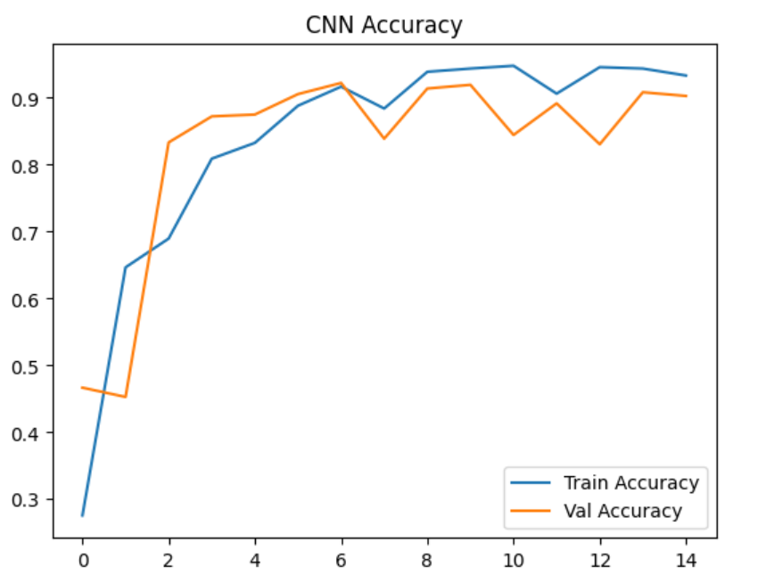
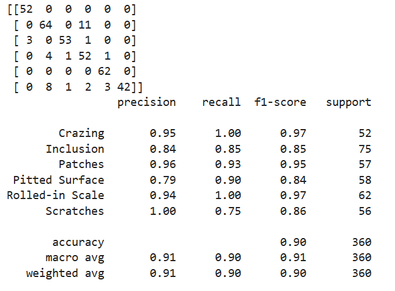
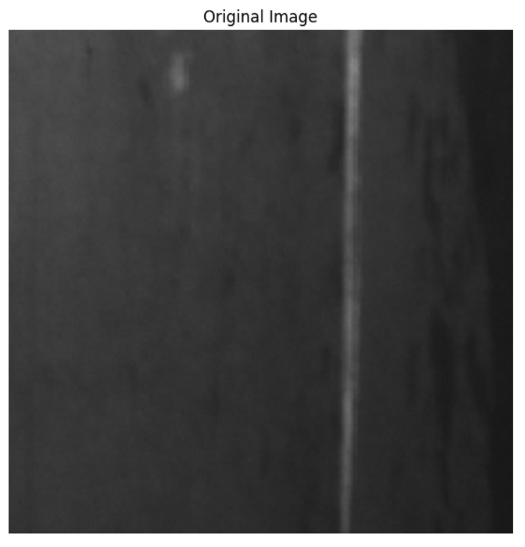
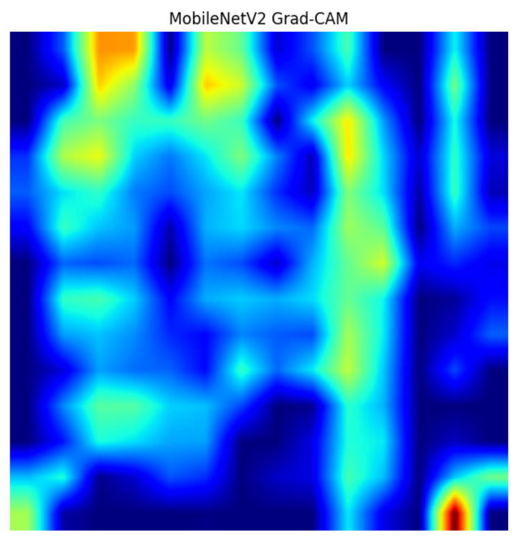

# Automated Steel Surface Defect Detection using CNN & Explainable AI

## 🚀 Live Demo: [CLICK HERE TO USE MODEL](https://steel-surface-defect-detection-4sqyy2ujebxhbkw5lfvdch.streamlit.app/)

## Project Overview

This project uses Deep Learning and Computer Vision to automatically detect and classify steel surface defects from industrial images.

The system identifies six defect categories:

* Crazing
* Inclusion
* Patches
* Pitted Surface
* Rolled-in Scale
* Scratches

To improve model transparency, Grad-CAM visualization is used to highlight the image regions responsible for predictions.

---

## Business Problem

Manual surface inspection in manufacturing is often slow, inconsistent, and prone to human error.

This project demonstrates how AI-powered visual inspection can help:

* Improve quality control
* Reduce defective products
* Increase inspection speed
* Support explainable decision-making

---

## Dataset

**NEU Surface Defect Database (NEU-CLS)**

* 1,800 grayscale images
* 6 defect classes
* Original image size: 200 × 200

Dataset Split:

* Training: 70%
* Validation: 15%
* Testing: 15%

---

## Technologies Used

* Python
* TensorFlow / Keras
* OpenCV
* NumPy
* Matplotlib
* Streamlit
* Explainable AI (Grad-CAM)

---

## Model Development

### Data Preparation

* Image resizing
* Normalization
* Data augmentation
* Train / Validation / Test split

### Model

* Convolutional Neural Network (CNN)
* Multi-class defect classification

---

## Model Performance

| Metric            | Value |
| ----------------- | ----- |
| Accuracy          | 90%   |
| Macro F1 Score    | 0.91  |
| Weighted F1 Score | 0.90  |

---

## Results

### Training Accuracy 



### Classification Report



### Original Defect Image



### Grad-CAM Visualization



Grad-CAM helps visualize which regions of the image influenced the model's prediction, making the system more interpretable and trustworthy.

---

## Project Structure

```text
steel-surface-defect-detection/
│
├── app.py
├── main.py
├── requirements.txt
├── README.md
│
├── model/
│   └── cnn_steel_defect_model.tflite
│
└── screenshots/
```

---

## Future Improvements

* Streamlit deployment
* Transfer Learning using MobileNetV2
* Real-time industrial inspection integration
* Support for additional manufacturing defect datasets

---

## Author

**Tanjeel Mujawar**

Data Analyst | Data Science | Machine Learning

📧 [mujawartanjeel@gmail.com](mailto:mujawartanjeel@gmail.com)
